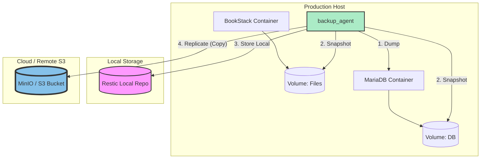

# Partie 6 - Plan de Reprise d'Activité (PRA / DRP)

Ce document synthétise la stratégie de continuité et de reprise d'activité mise en place pour l'infrastructure conteneurisée du projet SAE S6.

---

## 1. Executive Summary

L'objectif de ce plan est de garantir la disponibilité et l'intégrité des données critiques de la plateforme (BookStack, MariaDB, PostgreSQL) face à des sinistres majeurs ou des erreurs humaines. La stratégie repose sur une automatisation complète des sauvegardes via **Restic**, en respectant la règle **3-2-1** et en externalisant les données vers un stockage objet S3.

**Objectifs clés :**
- **Disponibilité :** Retrait rapide des services en moins de 30 minutes (RTO).
- **Intégrité :** Perte de données maximale d'une journée (RPO actuel).
- **Sécurité :** Chiffrement de bout en bout et isolation des sauvegardes.

---

## 2. Risk Assessment

Le tableau suivant identifie les risques majeurs pesant sur l'infrastructure et leur niveau de criticité.

| Risque | Description | Probabilité | Impact | Mitigations |
| :--- | :--- | :--- | :--- | :--- |
| **Panne matérielle** | Défaillance du disque ou du serveur hôte | Faible | Critique | Réplication distante (Copie 3) |
| **Erreur humaine** | Suppression accidentelle de volumes ou fichiers | Moyenne | Majeur | Snapshots Restic fréquents |
| **Cyberattaque** | Corruption de données ou Ransomware | Moyenne | Critique | Sauvegardes chiffrées hors site |
| **Bug Logiciel** | Corruption de la base de données après mise à jour | Haute | Faible | Dumps SQL quotidiens |

---

## 3. Backup Strategy : La Règle 3-2-1

Notre infrastructure de sauvegarde est bâtie sur les principes suivants :

### 3.1 Architecture 3-2-1
- **3 Copies des données :** Production (Volumes Docker), Dépôt local (`/backup_repo`), Dépôt distant (MinIO/S3).
- **2 Supports différents :** SSD Local du serveur, Stockage objet Cloud S3.
- **1 Copie hors site :** Externalisation automatique vers un bucket S3.

### 3.2 Outils et Méthode
- **Moteur :** [Restic](https://restic.net/) (Chiffrement AES-256, Déduplication).
- **Orchestration :** Script Bash [backup_orchestrator.sh](../scripts/backup_orchestrator.sh) piloté par un **Timer Systemd**.
- **Fréquence :** Quotidienne à 02:00 du matin.
- **Politique de Rétention (Pruning) :**
  - **7** dernières sauvegardes journalières.
  - **4** dernières sauvegardes hebdomadaires.
  - **12** dernières sauvegardes mensuelles.

---

## 4. Recovery Procedures (Procédures de Restauration)

Les procédures suivantes ont été validées lors de l'étape 5 avec des performances réelles mesurées.

### 4.1 Restauration partielle (Fichier unique)
- **Cas d'usage :** Suppression accidentelle d'un fichier applicatif.
- **Commande type :**
  ```bash
  docker compose run --rm backup_agent restore [snapshot_id] --target /restore --include [chemin_du_fichier]
  ```
- **RTO mesuré :** **2 secondes**.

### 4.2 Restauration de la base de données MariaDB
- **Cas d'usage :** Perte ou corruption de la base `bookstack`.
- **Procédure :** 
  1. Restauration du dump SQL depuis Restic.
  2. Injection du dump via `mysql -u root -p [db_name] < backup.sql`.
- **RTO mesuré :** **28 secondes**.

### 4.3 Reconstruction complète du service
- **Cas d'usage :** Destruction totale des conteneurs et volumes.
- **Procédure :**
  1. Restauration de la configuration Docker et des volumes de données.
  2. Recréation des volumes via `docker volume create`.
  3. Redémarrage de la stack via `docker-compose up -d`.
- **RTO mesuré :** **52 secondes**.

---

## 5. RTO/RPO Summary Table

Récapitulatif des objectifs (Cible) vs Résultats (Effectif).

| Service | RPO Cible | RPO Effectif | RTO Cible | RTO Effectif |
| :--- | :--- | :--- | :--- | :--- |
| **BookStack + MariaDB** | 1 heure | 24 heures* | 30 min | **52 secondes** |
| **Supervision** | 6 heures | 24 heures | 2 heures | Non testé |

> \* Note : Le RPO effectif est de 24h car le timer effectue une sauvegarde par jour. Pour atteindre l'objectif de 1h, la fréquence du timer systemd doit être augmentée.

---

## 6. Lessons Learned (Retours d'expérience)

### Ce qui a fonctionné :
- **Performance du RTO :** La technologie de déduplication de Restic et l'utilisation de dumps SQL permettent une restauration extrêmement rapide, largement en dessous de la cible de 30 minutes.
- **Externalisation :** La réplication vers S3 se fait de manière transparente juste après la sauvegarde locale.

### Ce qui peut être amélioré :
- **Optimisation du RPO :** Passer à une sauvegarde toutes les heures pour respecter l'objectif initial de 1h de perte maximale.
- **Automatisation des tests :** Mettre en place un pipeline CI/CD ou un script de "Shadow Restore" périodique pour valider l'intégrité des sauvegardes automatiquement.

---

## 7. Architecture Diagram


